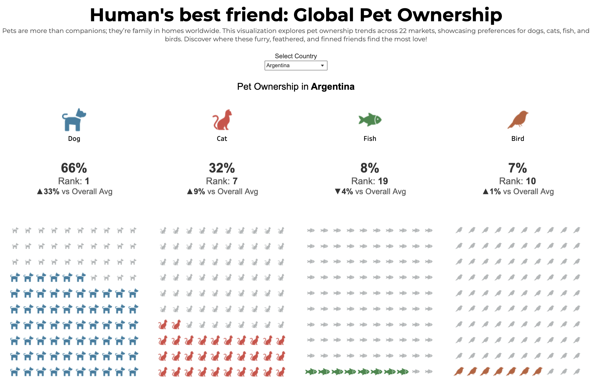

# Global Pet Ownership Dashboard 🐾  

### Overview  
Pets are more than just companions—they’re cherished members of households across the globe. This Tableau dashboard provides an interactive exploration of pet ownership trends across 22 markets, highlighting the percentages of households that own dogs, cats, fish, and other pets.  

### Features  
- **Dynamic Country Selection**: Choose a country to see the percentage of households owning different pets.  
- **Waffle Charts**: Visual representation of ownership percentages for dogs, cats, and fish.  
- **Key Performance Indicators (KPIs)**: Displaying ownership rank, percentage, and difference from the global average.  

### Snapshot 📸  
  

### Interactive Dashboard  
Explore the full dashboard on Tableau Public: [Global Pet Ownership Dashboard](https://public.tableau.com/views/PetOwnershipInternationallyMOM2025W16/MOM2025W16?:language=en-US&:sid=&:redirect=auth&:display_count=n&:origin=viz_share_link)  

### Dataset  
The dataset used for this visualization provides insights into global pet ownership trends, with data collected from 22 markets around the world.  

### How to Use  
1. Open the Tableau Public link above.  
2. Select a country from the dropdown to see its specific pet ownership data.  
3. Hover over the waffle charts or KPIs for detailed insights.  

### Technologies Used  
- Tableau for data visualization.  
- Data sourced from global pet ownership statistics.  

### Feedback  
If you have any feedback or suggestions, feel free to open an issue or reach out!  

